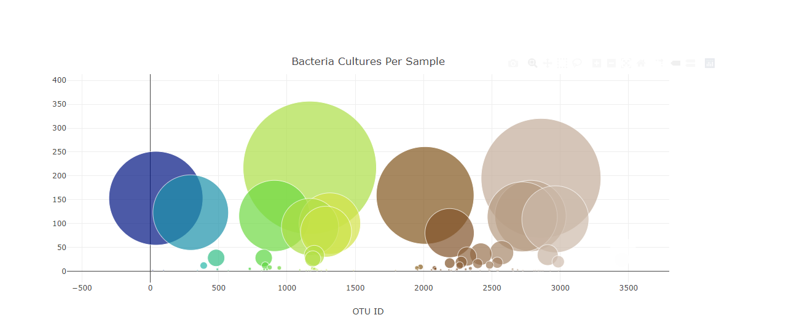
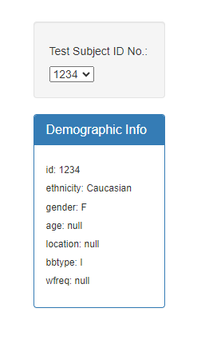
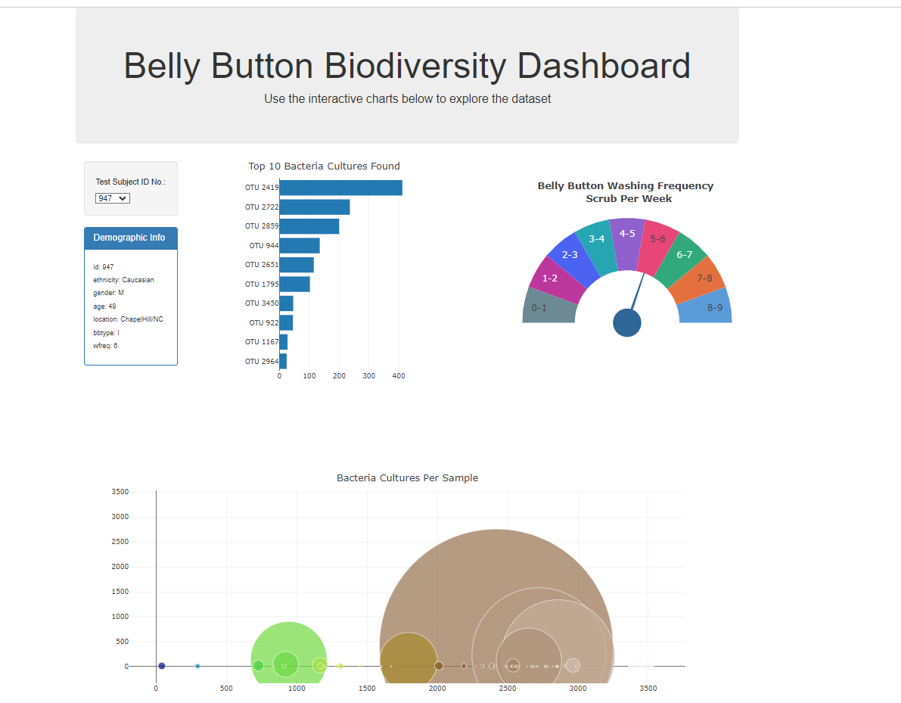
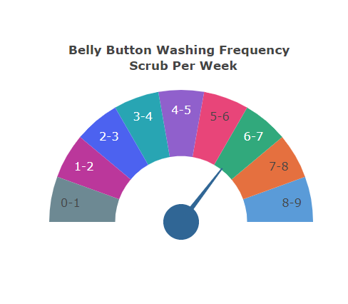

# Belly-Button-Challenge

## Instructions
### Steps:
1. Use the D3 library to read in samples.json from the URL https://2u-data-curriculum-team.s3.amazonaws.com/dataviz-classroom/v1.1/14-Interactive-Web-Visualizations/02-Homework/samples.json.
2. Create a horizontal bar chart with a dropdown menu to display the top 10 OTUs found in that individual.
  1. Use sample_values as the values for the bar chart.
  2. Use otu_ids as the labels for the bar chart.
  3. Use otu_labels as the hovertext for the chart.

### Output:

3. Create a bubble chart that displays each sample.
   1. Use otu_ids for the x values.
   2. Use sample_values for the y values.
   3. Use sample_values for the marker size.
   4. Use otu_ids for the marker colors.
   5. Use otu_labels for the text values.

### Output:

4. Display the sample metadata, i.e., an individual's demographic information.
5. Display each key-value pair from the metadata JSON object somewhere on the page.

### Output:
     

7. Update all the plots when a new sample is selected. Additionally, you are welcome to create any layout that you would like for your dashboard. An example dashboard is shown as follows:

### Output:

9. Deploy your app to a free static page hosting service, such as GitHub Pages. Submit the links to your deployment and your GitHub repo. Ensure that your repository has regular commits and a thorough README.md file

## Advanced Challenge Assignment

### The following task is advanced and therefore optional.
1. Adapt the Gauge Chart from https://plot.ly/javascript/gauge-charts/Links to an external site. to plot the weekly washing frequency of the individual.
2. You will need to modify the example gauge code to account for values ranging from 0 through 9.
3. Update the chart whenever a new sample is selected.

### Output:

